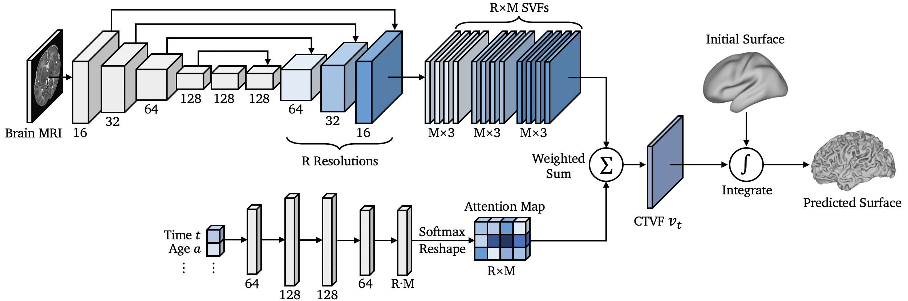
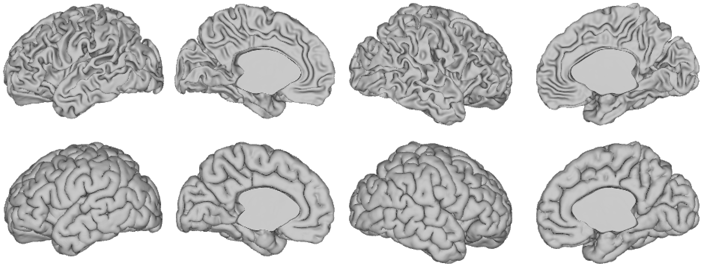

# Conditional Temporal Attention Networks for Neonatal Cortical Surface Reconstruction

[](https://arxiv.org/abs/2307.11870)
[](https://opensource.org/licenses/Apache-2.0)
[](https://pytorch.org/)
[](https://pytorch3d.org/)

This is the official PyTorch implementation of the paper: [Conditional Temporal Attention Networks for Neonatal Cortical Surface Reconstruction](https://conferences.miccai.org/2023/papers/136-Paper1290.html) (MICCAI 2023).




## Installation
The Conditional Temporal Attention Network (CoTAN) requires the following dependencies:
* PyTorch == 1.7.1
* PyTorch3D == 0.4.0 (for training only)
* Pandas == 1.2.4 (for training only)
* Nibabel == 3.2.1
* NumPy == 1.23.4
* ANTsPy == 0.3.4 (for registration only)
* SciPy == 1.10.0 (for registration only)


## Dataset
We use the third release of the dHCP neonatal dataset ([download](https://biomedia.github.io/dHCP-release-notes/download.html)). Once downloaded, the brain-extracted T2-weighted MRI images should be affinely aligned to the MNI-152 space. A clipped and brain-extracted MNI-152 template is provided in ```./template/mni152_brain_clip.nii.gz```. We use ANTsPy for affine registration, and please run
```
python register.py --move_path='/MOVE_PATH/moving_img.nii.gz'\
                   --save_path='/SAVE_PATH/warped_img.nii.gz'
```
to align the ```moving_img``` to the MNI template. The aligned/warped image will be saved to ```/SAVE_PATH/warped_img.nii.gz```. After registration, we assume that the dataset has the following file structure:
```
/YOUR_DATASET
    /train
        /sub-CC00050XX01_ses-7201
            /sub-CC00050XX01_ses-7201_T2w_brain_affine.nii.gz
            /sub-CC00050XX01_ses-7201_left_white.surf.gii
            /sub-CC00050XX01_ses-7201_left_pial.surf.gii
            /sub-CC00050XX01_ses-7201_right_white.surf.gii
            /sub-CC00050XX01_ses-7201_right_pial.surf.gii
        /sub-CC00051XX02_ses-7702
            /...
        /...
    /valid
        /...
    /test
        /...
    /combined.csv
```
where ```*_T2w_brain_affine.nii.gz``` is the affinely aligned T2w images, and ```combined.csv``` is the metadata ([download](https://biomedia.github.io/dHCP-release-notes/download.html#metadata)) containing the scan age of the subjects.


## Training
To train CoTAN for left/right white/pial surface reconstruction, please run:
```
python train.py --data_path='/YOUR_DATASET/'\
                --model_path='./model/'\
                --surf_type='white'\
                --surf_hemi='left'\
                --data_name='dhcp'\
                --tag='EXP_ID'\
                --step_size=0.02\
                --n_epoch=200\
                --device='cuda:0'
```
where ```data_path``` is the directory of your dataset, ```model_path``` is the directory to save the log and checkpoints of training, ```surf_type=['white','pial']``` is the type of the surface, ```surf_hemi=['left','right']``` is the brain hemisphere, ```data_name``` is a string to identify your dataset, ```tag``` is a string to identify your experiments, ```step_size``` is the step size for integration, and ```n_epoch``` is the number of epochs for training. For the details of all arguments please run ```python train.py --help```.

## Evaluation
For the inference, please run:
```
python pred.py --data_path='/YOUR_DATASET/YOUR_T2_MRI.nii.gz'\
               --save_path='/YOUR_RESULT/'\
               --age=40.0
```
where ```data_path``` is the file name of your affinely aligned T2w brain MRI, and ```age``` is the scan age (week) of your subject. The predicted surfaces will be saved to your ```save_path``` in GIfTI format ```.surf.gii```. For visualization of the surfaces, we recommend to use [Connectome Workbench](https://www.humanconnectome.org/software/connectome-workbench), which visualizes the predicted cortical surfaces as follows.

<p align="center"></p>